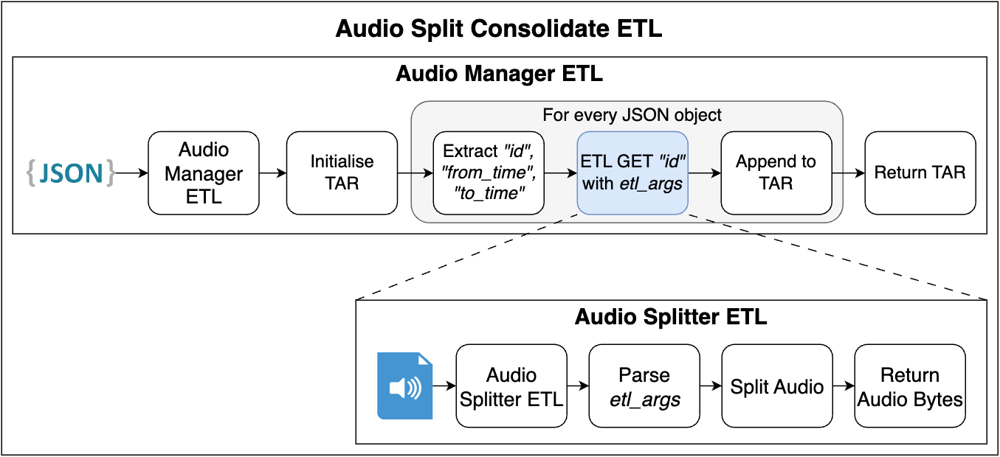

# AIStore Audio Split & Consolidate Transformer

This transformer splits and consolidates audio files using a [JSONL](https://jsonlines.org/) manifest file as input. It extracts segments specified in the manifest, consolidates them, and returns the result as a tarball.

This transformer consists of two components:

1. **Audio Manager** – Processes the manifest and dispatches splitting tasks.
2. **Audio Splitter** – Splits individual audio files based on instructions from the Audio Manager.

---

## Why two separate transformers?

Using separate transformers ensures scalability through distributed processing. A single transformer combining both roles would not scale efficiently, as audio files might not reside on the same node, causing performance issues due to unnecessary data movement between nodes. Separating the roles allows efficient distributed processing across the AIStore cluster.



---

## Example Input Manifest

`manifest.jsonl`:
```json
{"id": "youtube_vid_id_1", "part": 1, "from_time": 0.36, "to_time": 2.36}
{"id": "youtube_vid_id_1", "part": 2, "from_time": 3.36, "to_time": 9.36}
{"id": "youtube_vid_id_2", "part": 1, "from_time": 0.0, "to_time": 4.0}
```

Output:
- A tarball (`manifest.tar`) containing:
  - `youtube_vid_id_1_1`
  - `youtube_vid_id_1_2`
  - `youtube_vid_id_2_1`

Each file will contain audio trimmed to the specified duration.

---

## How to Get Started

### Step 1: Prepare the Manifest

Create a JSON Lines (`.jsonl`) file where each line contains:
- `id`: Identifier of the audio file.
- `part`: Part number.
- `from_time` and `to_time`: Segment duration.

---

## Deploy ETLs

### Audio Splitter ETL

Review and edit the configuration ([`audio_splitter/pod.yaml`](audio_splitter/pod.yaml)) as needed.

```bash
ais etl init spec --from-file audio_splitter/etl_spec.yaml
```

### Audio Manager ETL

Review and edit the configuration ([`audio_manager/pod.yaml`](audio_manager/pod.yaml)), ensuring settings match your environment.

```bash
ais etl init spec --from-file audio_splitter/etl_spec.yaml
```

Ensure the manifest file is accessible by the Audio Manager.

---

## Run Transformations

### Single Manifest File

```bash
ais etl object audio-manager ais://manifests/manifest.jsonl manifest.tar
```

### Batch Operation (Multiple Manifest Files - Bucket Transform)

```bash
ais etl bucket audio-manager ais://bench_manifests ais://output_bucket --ext "{jsonl:tar}"
```

This will process each `.jsonl` file in the source bucket and output consolidated audio tarballs (`.tar`) into the specified output bucket.


## Performance  

Our [benchmark](../../benchmarks/audio_split_consolidate.py) demonstrates that using our ETL can accelerate data processing by **up to 13x** compared to single-threaded local execution. Performance scales **linearly** with the number of targets and disks in the AIStore cluster.