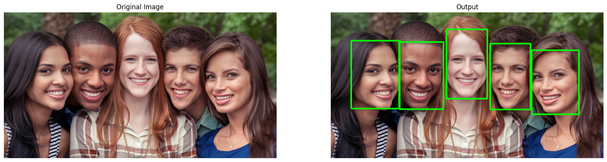

# Face Detection Using Single Shot Multibox Detector (SSD) Model

This document outlines the process of utilizing the `Single Shot MultiBox Detector (SSD)` model for face detection in images. The SSD model predicts and places bounding boxes over faces in an image. For further reading on the SSD model, visit the [research paper](https://arxiv.org/abs/1512.02325).



> **Note**: Due to size constraints, the model's weights and architecture are not included in this directory. They are pre-loaded in the transformer's Docker [image](https://hub.docker.com/r/aistorage/transformer_face_detection).

## Image Format Specification

The image formats (`jpeg`, `png`, etc.) for processing or storage are defined in the [`pod.yaml`](pod.yaml) file.

## Transformer Communication Mechanisms

The transformer is compatible with `hpull` and `hpush` for seamless integration. Detailed information about these communication mechanisms can be found [here](https://github.com/NVIDIA/aistore/blob/main/docs/etl.md#communication-mechanisms).

## Recommended Parameter Setting

For efficient transformation, use `fqn` as `ARG_TYPE` in the [`pod.yaml`](pod.yaml) file. This approach allows for local object reading from the target, reducing the time required for each transformation.

## Web Server Framework

The transformer employs the [`FastAPI`](https://fastapi.tiangolo.com/) framework, and uses [`Gunicorn`](https://gunicorn.org/) and [Uvicorn](https://www.uvicorn.org/) as the web server combination.

## Configurable Parameters

Adjust the following parameters in the `pod.yaml` file as per your requirements:

| Argument   | Description                                                         | Default Value |
|------------|---------------------------------------------------------------------|---------------|
| `FORMAT`   | Image format for processing/storing (png, jpeg, etc.)                | "jpeg"        |
| `ARG_TYPE` | Local object reading (`fqn`) vs. HTTP request for object retrieval   | ""            |
| `FILE_FORMAT` | Configure as "tar" for processing datasets in the webdataset format or for handling batches of images packaged in a tarball   | ""            |

### Setting Up the Face Detection Transformer with AIStore CLI

To initialize the `Face Detection Transformer` using the [AIStore CLI](https://github.com/NVIDIA/aistore/blob/main/docs/cli.md), follow these steps:

```bash
# Navigate to the transformer directory
cd transformers/face_detection

# Set FORMAT and ARG_TYPE environment variables
export FORMAT="jpeg"
export ARG_TYPE="" # Or use 'fqn' for local reading
export FILE_FORMAT="" # or use "tar", if using webdataset format

# Define communication type
export COMMUNICATION_TYPE="hpush://"

# Generate an initialization specification file
envsubst < pod.yaml > init_spec.yaml

# Initialize the ETL process
ais etl init spec --from-file init_spec.yaml --name <etl-name> --comm-type $COMMUNICATION_TYPE

# Use the ETL for transforming and retrieving objects
# For inline transformation
ais etl object <etl-name> ais://src/<image-name>.JPEG dst.JPEG

# For offline (bucket-to-bucket) transformation
ais etl bucket <etl-name> ais://src-bck ais://dst-bck --ext="{jpg:jpg}"

# or, if using webdataset style format
# ais etl bucket <etl-name> ais://src-bck ais://dst-bck --ext="{tar:tar}"
```